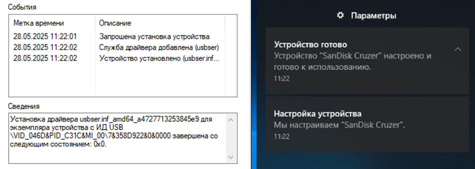

BADUSB 

BadUSB это класс аппаратных атак, использующих уязвимости USB-устройств, связанные с возможностью их перепрошивки. Злоумышленник может модифицировать прошивку USB-устройства, превращая его в эмуляцию клавиатуры, мыши или сетевого адаптера. Это позволяет незаметно выполнять вредоносные команды, такие как кража данных, rce, шифрование файлов и тд.

Механизм атаки

При подключении устройства к ПК оно ожидает 5 секунд, после чего эмулирует нажатие клавиш. Сначала открывается окно "Выполнить" через комбинацию Win+R, затем вводится команда для запуска PowerShell в скрытом режиме. Далее запускается CMD, где выполняется PowerShell-скрипт (enc.ps1), сохраняемый во временной папке. Этот скрипт определяет пути к файлу test.txt (рабочий стол), зашифрованному файлу test_encrypted.hh2025 и записке RANSOM_INFO.txt. Скрипт генерирует случайный ключ и использует алгоритм AES-256 для шифрования содержимого test.txt. Результат сохраняется в test_encrypted.hh2025, после чего оригинальный файл удаляется. Создаётся записка RANSOM_INFO.txt, содержащая сообщение о шифровании, требование выкупа в 1 BTC на фейковый адрес и тестовой ключ для демонстрации. Для сокрытия следов скрипт удаляет себя, стирает логи PowerShell и системы, а также очищает историю команд. Код запускает скрипт скрытно и закрывает CMD. Для надёжности атака выполняется дважды переключая раскладку.

Маскировка устройства

При первом подключении Windows отображает уведомление о настройке устройства "Arduino Micro" с VID/PID, соответствующими оригинальной плате. Чтобы избежать обнаружения, файл boards.txt в Arduino IDE был модифицирован: название изменено на "SanDisk Cruzer", а VID/PID — на значения клавиатуры Logitech (VID_046D, PID_C31C). 

Эта маскировка снижает вероятность детекции EDR-системами, так как устройство воспринимается как легитимная клавиатура, а название флешки не вызывает подозрений. Плюс badusb замаскирована в легитный корпус.

Расширение для реальной атаки

Для имитации реальной атаки шифрование можно расширить: вместо одного файла test.txt обработать всю директорию пользователя на диске C (например, C:\Users\), включая определённые типы файлов (документы, изображения) или сетевые папки. Хакер может арендовать bulletproof-хостинг, развернуть веб-сервер на Python и сгенерировать пару RSA-ключей (открытый и закрытый). Открытый ключ и ссылка на сервер добавляются в прошивку HW-374. AES-ключ, используемый для шифрования файлов, шифруется открытым RSA-ключом и отправляется на сервер. Хакер расшифровывает его приватным ключом и ожидает контакт жертвы. В RANSOM_INFO.txt указываются контакты (например, email или Telegram) для переговоров о выкупе. Также стоит убрать очистку логов так как они требуют права администратора (маловероятно что они есть у пользователя на работе). Распространение устройств может осуществляться под видом подарков от компании с поддельным сертификатом на флешке, что усиливает социальный инжиниринг.

Меры защит от BadUSB:

1) Применение контроля USB-устройств с использованием встроенных функций средств (криптографической) защиты информации (vipnet, secretnet и тд.). 
Плюсы: Автоматическое блокирование несанкционированных устройств.
Минусы: Возможность обхода через найденные 0-day уязвимости.

2) Удаление или заливка термоклеем всех USB-портов.
Плюсы: Надежность, исключающая незаметный и быстрый взлом.
Минусы: Необходимость перехода на другие интерфейсы.

3) Деактивация USB-портов через настройки BIOS/UEFI.
Плюсы: Быстрая реализация защиты.
Минусы: Возможность повторного включения портов.

4) Использование заглушек портов (espada и др.).
Плюсы: Простота установки.
Минусы: Возможность снятия заглушек подручными средствами, например, прищепкой.