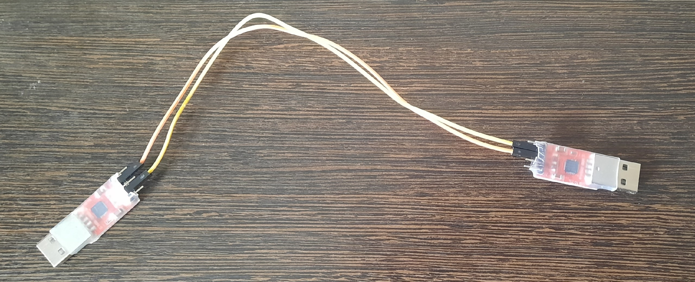
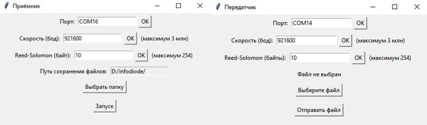
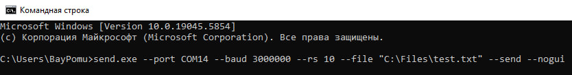
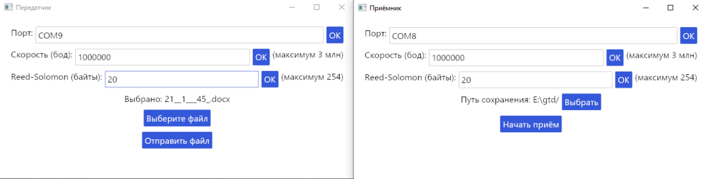
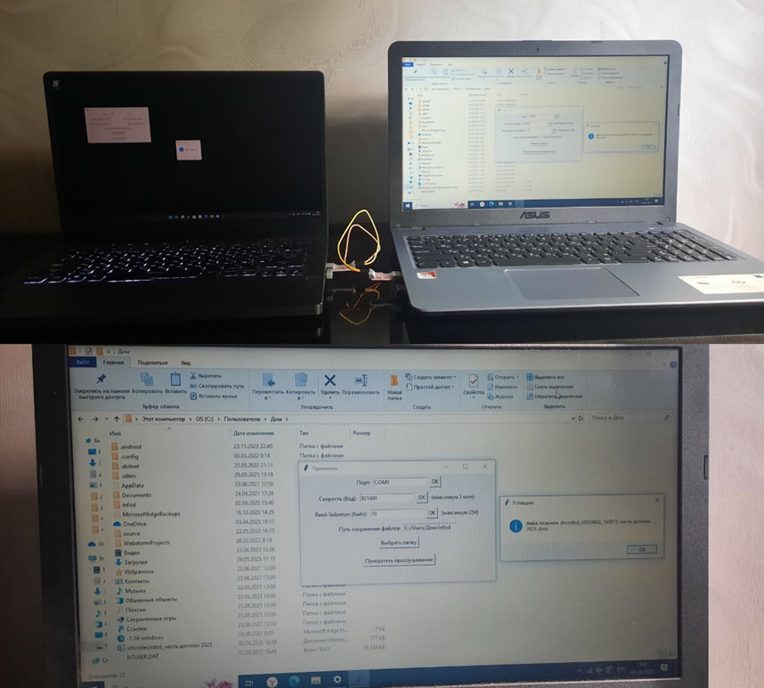

# DATADIODE

## Аппаратная часть

Для обеспечения однонаправленной передачи данных в изолированном сегменте корпоративной сети, разработан программно-аппаратный комплекс. Аппаратная часть датадиода собрана с использованием двух модулей USB UART CP2102, обеспечивающих последовательную передачу данных. Сборка выполнена путём соединения двух перемычек: линия передачи данных (TX) передатчика подключена к линии приёма данных (RX) приёмника, а общий провод GND соединён с соответствующим контактом GND для заземления. Такая конфигурация гарантирует физическую невозможность обратной передачи данных, исключая несанкционированный доступ.

## Програмная часть

Было разработано программное обеспечение на языке Python, включающее графический (GUI) и командный (CLI) интерфейсы. Графический интерфейс позволяет администратору задавать параметры передачи, включая COM-порт, автоматически определяемый приложением для модулей USB UART CP2102, скорость передачи в бодах и количество проверочных байтов Reed-Solomon для коррекции ошибок. Скорость передачи данных установлена на стабильное значение 3 Мбит/с (3 млн бод), хотя возможно тестирование более высоких скоростей, что может привести к потерям данных из-за длинных перемычек или аппаратных ограничений. 
Поле Reed-Solomon определяет количество проверочных байтов, обеспечивающих обнаружение и исправление ошибок: например, при 50 байтах возможно исправление до 25 ошибок, так как один байт используется для локализации ошибки, а другой — для её восстановления. Интерфейс также предоставляет возможность выбора директории для сохранения файлов и указания передаваемого файла.

Процесс передачи начинается с запуска приёмника на одном ПК, где выбирается директория для сохранения и активируется режим ожидания данных. На втором ПК запускается передатчик, где указывается файл для отправки, после чего данные передаются через датадиод. Приёмник сохраняет бинарный файл, удаляет проверочные байты и восстанавливает исходный формат файла. Программа поддерживает передачу одного файла за раз.
Для автоматизации CLI-интерфейс позволяет запускать приложение через планировщика задач: приёмник активируется ежедневно в 16:35 с параметрами порта COM16, скорости 3 Мбит/с, 10 проверочных байтов и директории D:\Infodiode, а передатчик — в 16:37 с параметрами порта COM14 и файлом C:\Files\test.txt.

Приёмник: receiver.exe --port COM16 --baud 3000000 --rs 10 --dir "D:\Infodiode" --start --nogui

Передатчик: send.exe --port COM14 --baud 3000000 --rs 10 --file "C:\Files\test.txt" --send --nogui

Также данное приложение было переписано на язык программирования Rust.

## Тестирование

Тестирование программы проведено на двух ноутбуках, с успешной передачей файла Word размером 777 КБ, подтвердившей корректность работы приложения.

Экономическая эффективность данного решения обусловлена использованием недорогих компонентов USB UART CP2102 и минимальными затратами на разработку, сохраняя при этом функциональность для определённых сценариев. Однако разработанный датадиод имеет ограничениями: скорость передачи данных, ограниченную 3 Мбит/с, что существенно ниже показателей оптоволоконных датадиодов, и отсутствие сертификации, необходимой для соответствия нормативным требованиям. Это делает его неприменимым для предприятий, подпадающих под действие Федерального закона № 187-ФЗ о критической информационной инфраструктуре, обрабатывающих персональные данные первого и второго уровней по Федеральному закону № 152-ФЗ или взаимодействующих с государственным центром обнаружения и предотвращения кибератак (ГосСОПКА). Решение подходит для предприятий, работающих с персональными данными третьего уровня, например такими как фамилия, имя, отчество, дата рождения, пол и адрес электронной почты, при условии, что база данных содержит не более 100 тысяч пользователей или вообще, не обрабатывают персональные данные. В таких случаях использование разработанного датадиода обеспечивает достаточный уровень безопасности при минимальных затратах.

